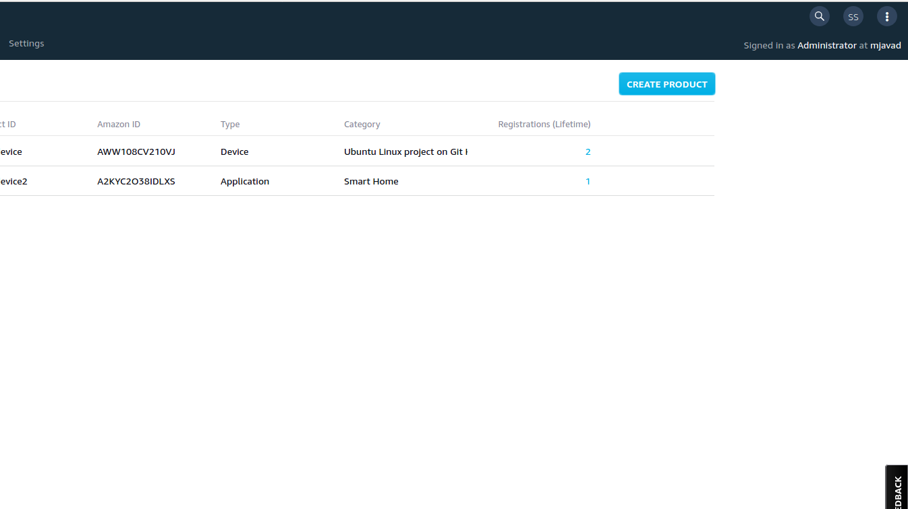
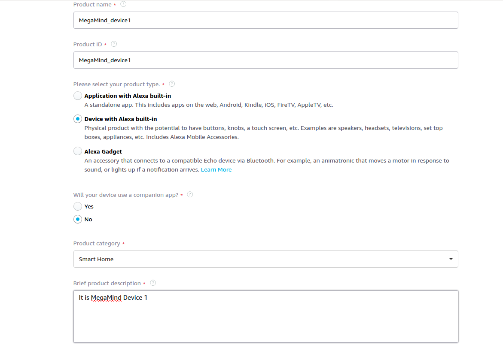
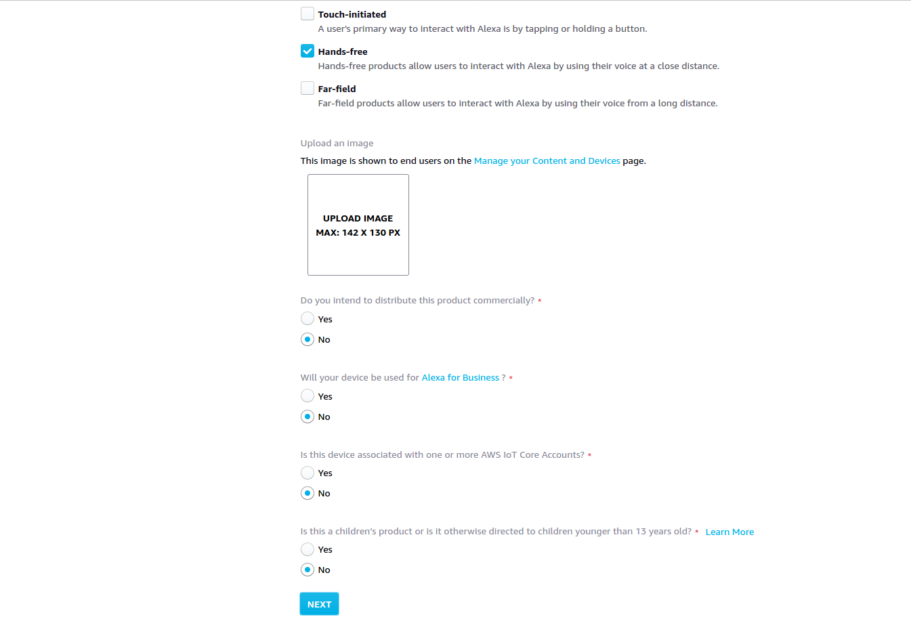
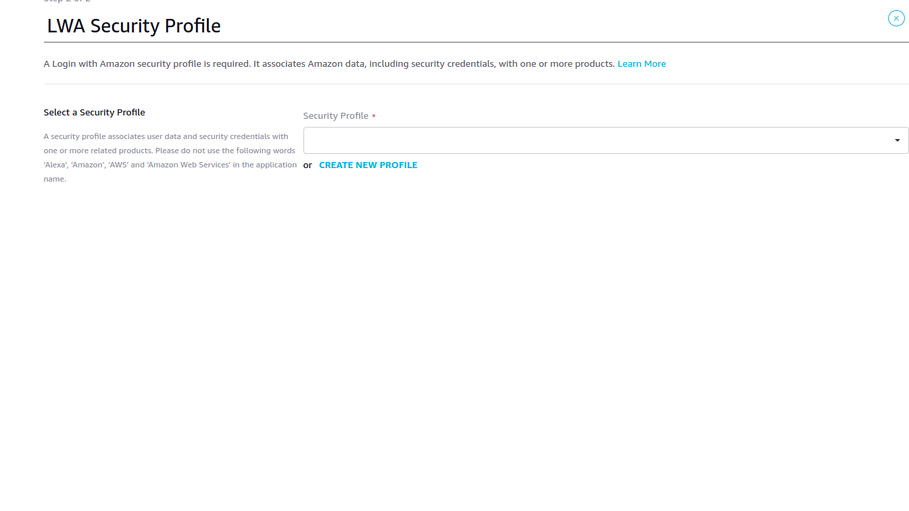
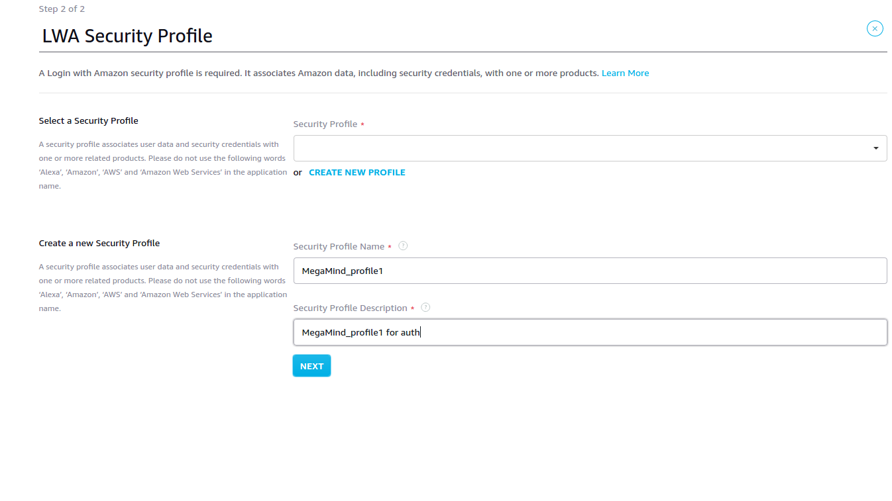
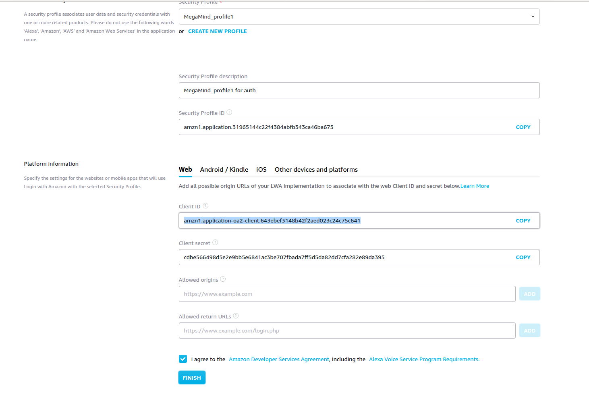
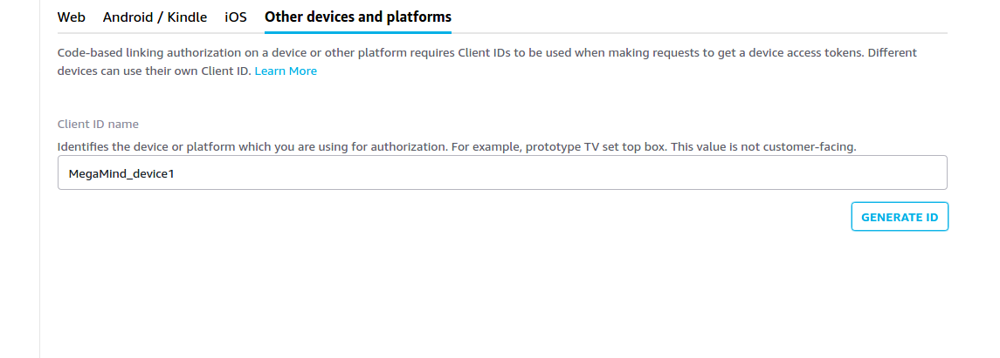

# Create Amazon developer account and register a device with it

you can use your normal Amazon account to log-in to https://developer.amazon.com/ 

After logging-in to your Amazon account go-to https://developer.amazon.com/alexa/console/avs/products

Then click on Create Product then. Fill the form as following

Click Next.
Then
In this page click on CREATE NEW PROFILE
Fill the form as above and click Next

In this step click on Other devices and platforms tab.

Enter MegaMind_device1 as client_ID name and click on GENERATE ID button.
Copy the generated Client ID and keep it on your machine.
Choose I agree .. and click Finish. 

