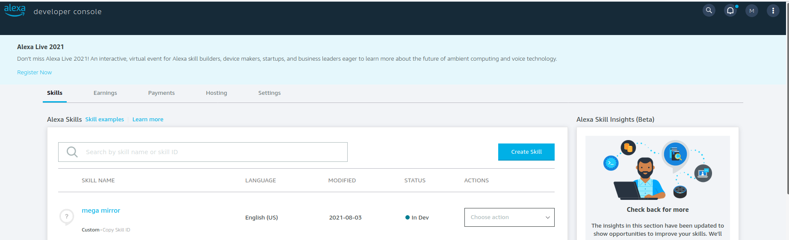

# Deploy MegaMind's skills on your Alexa account

you need to log-in to Alexa developer account using the same Amazon account you used to register your device. (Alexa developer console is on: https://developer.amazon.com/alexa/console/ask).

After logging-in, from the skill tab press "Create Skill" button. 

On the next page, please insert the name of the skill. (e.g. Mega Mirror)

On the same page, for item 1, please select "Custome", and for item 2, please select "Alexa-hosted(Python)"
  
then press "Create Skill".
On the next page select "Start from Scratch" and press "Continue with template".
 
It will take a few minutes before it generate a new skill.
On the skill page, in the left side of the page, from the "Interaction Model" menu please select "JSON Editor". Here you need to replace the content of the Json file with the content of your desired Skill. 
For example, let assume you want to deploy the "repeat conversation" skill. Go to ``$WD/MegaMind/Skills/repeat_conversation`` and copy the contents of the ``model.json`` file.
 
Then on top of the same page press, "Save model" and "Build model".
As the next step we need to replace the python code of the skill from the sample code to our skill code. 
In the menu bar above "Save model",... please clik on "Code" it is located between "Build" and "test"

Here you need to replace the contents of "lambda_function.py" and "requierments.txt" with the files with same names under ``$WD/MegaMind/Skills/repeat_conversation``. Then press save and deploy. 
The skill is ready to be used with your device.
Please repeat these steps for "secret_chat" skill located on ``$WD/MegaMind/Skills/secret_chat``

